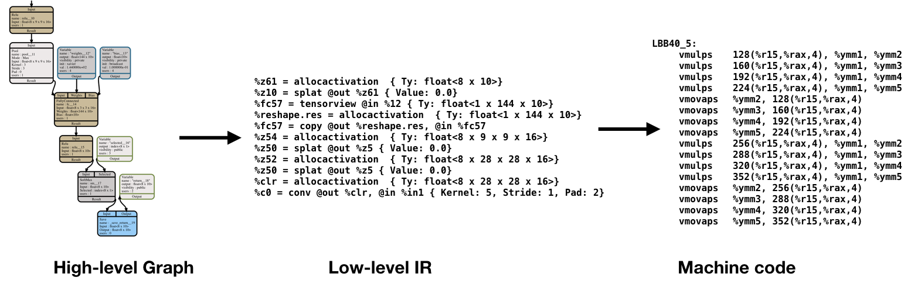

[](https://circleci.com/gh/pytorch/glow)


Glow is a machine learning compiler and execution engine for hardware
accelerators.  It is designed to be used as a backend for high-level machine
learning frameworks.  The compiler is designed to allow state of the art
compiler optimizations and code generation of neural network graphs. This
library is in active development. The project plan is described in the Github
issues section and in the
[Roadmap](https://github.com/pytorch/glow/wiki/Glow-Roadmap) wiki page.

## Partners

Contributions to Glow are welcomed and encouraged! Glow is developed in
collaboration with the following partners:


<!---
Note:
List of partner logos sorted alphabetically column order.
-->

|  |  |   |
:-------------------------:|:-------------------------:|:-------------------------:
|  |  |  |
|    |   |  |
|   |  |  |


## How does it work?

Glow lowers a traditional neural network dataflow graph into a two-phase
strongly-typed [intermediate representation (IR)](./docs/IR.md). The high-level
IR allows the optimizer to perform domain-specific optimizations. The
lower-level instruction-based address-only IR allows the compiler to perform
memory-related optimizations, such as instruction scheduling, static memory
allocation and copy elimination. At the lowest level, the optimizer performs
machine-specific code generation to take advantage of specialized hardware
features. Glow features a lowering phase which enables the compiler to support a
high number of input operators as well as a large number of hardware targets by
eliminating the need to implement all operators on all targets. The lowering
phase is designed to reduce the input space and allow new hardware backends to
focus on a small number of linear algebra primitives.
The design philosophy is described in an [arXiv paper](https://arxiv.org/abs/1805.00907).



## Getting Started

### System Requirements

Glow builds and runs on macOS and Linux. The software depends on a modern C++
compiler that supports C++11, on CMake, LLVM (>=7.0), glog, protocol buffers, and
libpng.

#### Get Glow!

  ```bash
  git clone git@github.com:pytorch/glow.git  # or: git clone https://github.com/pytorch/glow.git
  cd glow
  ```

#### Submodules

Glow depends on a few submodules: googletest, onnx, and a library
for FP16 conversions.

To get them, from the glow directory, run:

  ```bash
  git submodule update --init --recursive
  ```

#### Source dependencies

Glow depends on `fmt`, which must be built from source:
```bash
git clone https://github.com/fmtlib/fmt
mkdir fmt/build
cd fmt/build
cmake ..
make
sudo make install
```

#### macOS

Install the required dependencies using either [Homebrew](https://brew.sh/) or
[MacPorts](https://www.macports.org/). If using Homebrew, run:

  ```bash
  brew install cmake graphviz libpng ninja protobuf wget glog autopep8 llvm   \
      boost double-conversion gflags jemalloc libevent lz4 openssl pkg-config \
      snappy xz
  ```

If using MacPorts, run:

  ```bash
  port install cmake graphviz libpng ninja protobuf-cpp wget google-glog \
      boost double-conversion gflags jemalloc libevent lz4 openssl snappy xz
  # Choose version >= 7
  export LLVM_VERSION=7
  port install llvm-$LLVM_VERSION.0 
  ```


Note that LLVM is installed in a non-default location to avoid conflicts with
the system's LLVM --Homebrew usually installs LLVM in `/usr/local/opt/llvm/`,
whereas MacPorts installs it in `/opt/local/libexec/llvm-$LLVM_VERSION.0/`. This means that
CMake will need to be told where to find LLVM when building; instructions on
that can be found [here](#building-with-dependencies-llvm).

Finally, create a symbolic link to the Homebrew- or MacPorts-installed
`clang-*` tools so that the `utils/format.sh` script is able to find them later
on. For a Homebrew-managed installation, run:
  ```
  ln -s "/usr/local/opt/llvm/bin/clang-format" "/usr/local/bin/clang-format"
  ln -s "/usr/local/opt/llvm/bin/clang-tidy" "/usr/local/bin/clang-tidy"
  ```
For MacPorts, run:
  ```
  ln -s "/opt/local/libexec/llvm-$LLVM_VERSION.0/bin/clang-format" "/usr/local/bin/clang-format"
  ln -s "/opt/local/libexec/llvm-$LLVM_VERSION.0/bin/clang-tidy" "/usr/local/bin/clang-tidy"
```

> **Note:** Starting with macOS Mojave, Xcode's command line tools changed header layout. 
> In order for Glow to build on Mojave, you might need to install
> `macOS_SDK_headers_for_macOS_10.14.pkg`, located in 
> `/Library/Developer/CommandLineTools/Packages/`.
> For macOS Catalina you might need to explicitly specify SDKROOT: 
> `export SDKROOT="/Library/Developer/CommandLineTools/SDKs/MacOSX.sdk"`


#### Ubuntu

[The following instructions have been tested on Ubuntu 16.04 and 18.04]

In order to build Glow on Ubuntu it is necessary to install a few packages. The
following command should install the required dependencies:

  ```bash
  sudo apt-get install clang clang-8 cmake graphviz libpng-dev \
      libprotobuf-dev llvm-8 llvm-8-dev ninja-build protobuf-compiler wget \
      opencl-headers libgoogle-glog-dev libboost-all-dev \
      libdouble-conversion-dev libevent-dev libssl-dev libgflags-dev \
      libjemalloc-dev libpthread-stubs0-dev
  ```

[Note: Ubuntu 16.04 and 18.04 ship with llvm-6 and need to be upgraded before building Glow. Building Glow on Ubuntu 16.04 with llvm-7 fails because llvm-7 xenial distribution uses an older c++ ABI, however building Glow on Ubuntu 18.04 with llvm-7 has been tested and is successful]

It may be desirable to use `update-alternatives` to manage the version of
clang/clang++:

  ```bash
  sudo update-alternatives --install /usr/bin/clang clang \
      /usr/lib/llvm-8/bin/clang 50
  sudo update-alternatives --install /usr/bin/clang++ clang++ \
      /usr/lib/llvm-8/bin/clang++ 50
  ```

Glow uses the system default C/C++ compiler (/usr/bin/c++), and so you may also
want to switch your default C/C++ compiler to clang:

  ```bash
  sudo update-alternatives --config cc
      # Select the option corresponding to /usr/bin/clang ...
  sudo update-alternatives --config c++
      # Select the option corresponding to /usr/bin/clang++ ...
  ```

Glow *should* build just fine with gcc (e.g. gcc 5.4), but we mostly use clang
and are more attentive to compatibility with clang.

Finally, in order to support the ONNX net serialization format, Glow requires
`protobuf >= 2.6.1`, but the above command may install older
version on older Ubuntu (e.g. 14.04). If this is the case, we suggest to look
at `utils/install_protobuf.sh` to install a newer version from source.

For details on installing OpenCL on Ubuntu please see
[these instructions](docs/Building.md#opencl-on-ubuntu).

### Configure and Build

To build the compiler, create a build directory and run cmake on the source
directory. It's a good idea to build two configurations (Release and Debug)
because some programs take a really long time to run in Debug mode. It's also a
good idea to build the project outside of the source directory.

  ```bash
  mkdir build_Debug
  cd build_Debug
  cmake -G Ninja -DCMAKE_BUILD_TYPE=Debug ../glow
  ninja all
  ```

It's possible to configure and build the compiler with any CMake generator,
like GNU Makefiles, Ninja and Xcode build.

For platform-specific build instructions and advanced options, such as
building with Address-Sanitizers refer to this guide:
[Building the Compiler](docs/Building.md).

If you're running macOS v10.14 (Mojave) and `ninja all` fails because it can't
find headers (e.g. `string.h`), run this command to fix it, and try again.
More information is available [here](https://developer.apple.com/documentation/xcode_release_notes/xcode_10_release_notes)
under "Command Line Tools".

  ```bash
  open /Library/Developer/CommandLineTools/Packages/macOS_SDK_headers_for_macOS_10.14.pkg
  ```

For macOS v10.15 (Catalina) you might need to explicitly specify SDKROOT:

   ```bash
   export SDKROOT="/Library/Developer/CommandLineTools/SDKs/MacOSX.sdk"
   ```


#### Building with dependencies (LLVM)

By default, Glow will use a system provided LLVM.  Note that Glow requires LLVM
7.0 or later. If you have LLVM installed in a non-default location (for
example, if you installed it using Homebrew on macOS), you need to tell CMake
where to find llvm using `-DLLVM_DIR`. For example, if LLVM were
installed in `/usr/local/opt`:

  ```bash
  cmake -G Ninja ../glow \
      -DCMAKE_BUILD_TYPE=Debug \
      -DLLVM_DIR=/usr/local/opt/llvm/lib/cmake/llvm
  ```

If LLVM is not available on your system you'll need to build it manually.  Run
the script '`/utils/build_llvm.sh` to clone, build and install LLVM in a local
directory. You will need to configure Glow with the flag `-DLLVM_DIR` to tell
the build system where to find LLVM given the local directory you installed it
in (e.g. `-DLLVM_DIR=/path/to/llvm_install/lib/cmake/llvm` if using
`build_llvm.sh`).

## Testing and Running

### Unit tests

The project has a few unit tests in the tests/unittests subdirectory. To run all
of them, simply run `ninja test`.

### C++ API examples

A few test programs that use Glow's C++ API are found under the `examples/`
subdirectory. The `mnist`, `cifar10`, `fr2en` and `ptb` programs train and run digit
recognition, image classification and language modeling benchmarks,
respectively.

To run these programs, build Glow in Release mode, then run the following commands
to download the cifar10, mnist and ptb databases.

  ```bash
  python ../glow/utils/download_datasets_and_models.py --all-datasets
  ```

Now run the examples. Note that the databases should be in the current working
directory.

  ```bash
  ./bin/mnist
  ./bin/cifar10
  ./bin/fr2en
  ./bin/ptb
  ./bin/char-rnn
  ```

If everything goes well you should see:
  * `mnist`: pictures from the mnist digits database
  * `cifar10`: image classifications that steadily improve
  * `fr2en`: an interactive French-to-English translator
  * `ptb`: decreasing perplexity on the dataset as the network trains
  * `char-rnn`: generates random text based on some document

Note that the default build mode is `Debug`, which means that the compiler
itself is easy to debug because the binary contains debug info, lots of
assertions, and the optimizations are disabled. It also means that the compiler
and runtime are very slow, and the execution time can be hundreds of times
slower than that of release builds. If you wish to benchmark the compiler, run
long benchmarks, or release the product then you should compile the compiler in
Release mode. Check the main CMake file for more details.

More details on testing and running Glow can be found in:
[Testing the Glow Compiler](docs/Testing.md).

### Ahead-of-time Compilation

Glow can be used to compile neural networks into object files containing native
code.  We provide resnet50 (both quantized and non-quantized versions) as an
example of this capability in `examples/bundles/resnet50`.  See [Creating
Standalone Executable Bundles](docs/AOT.md) for more detail.

## Contributing

To get started contributing, please refer to the following guides:
* [Contributing](CONTRIBUTING.md)
* [Coding Standards](docs/CodingStandards.md)
* [Code of Conduct](CODE_OF_CONDUCT.md)

### Communication

* Forums: discuss implementations, research, etc: https://discuss.pytorch.org/c/glow.
  Make sure to label topic with the ["glow"](https://discuss.pytorch.org/c/glow) category.
* GitHub issues: bug reports, feature requests, install issues, RFCs, thoughts, etc.

## License

Glow is licensed under the [Apache 2.0 License](LICENSE).
