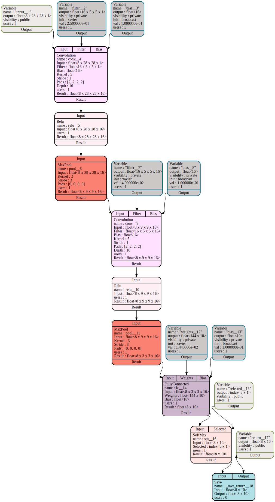

# LeNet MNIST Example

This document walks through the construction of a simple CNN (LeNet, for
classifying handwritten digits from the MNIST dataset).  We show how to use
Glow's C++ API, and the various IR stages, up to the JIT backend.  We intend
this guide to help backend implementers understand the compilation pipeline.

## Creating a Network

Glow provides C++ APIs for manually constructing a network.  (In practice, we
expect Glow's frontend to be driven by Caffe2 models, but we show the C++ here
to demystify that interface).

The following snippet constructs a graph of tensor operations, declares input
and output variables, and compiles the graph for inference:

```
// Create a graph (Function) object.
ExecutionEngine EE;
auto &mod = EE.getModule();
Function *F = mod.createFunction("main");

// Declare input: a minibatch of 28x28 images.
Variable *A = mod.createVariable(
    ElemKind::FloatTy, {minibatchSize, 28, 28, 1}, "input",
    VisibilityKind::Public, Variable::TrainKind::None);

// Construct LeNet.
auto *CV0 = F->createConv("conv", A, 16, 5, 1, 2, 1);
auto *RL0 = F->createRELU("relu", CV0);
auto *MP0 = F->createPoolMax("pool", RL0, 3, 3, 0);

auto *CV1 = F->createConv("conv", MP0, 16, 5, 1, 2, 1);
auto *RL1 = F->createRELU("relu", CV1);
auto *MP1 = F->createPoolMax("pool", RL1, 3, 3, 0);

auto *FCL1 = F->createFullyConnected("fc", MP1, 10);

// Declare output: an index (0-9) indicating which digit is seen.
Variable *selected = mod.createVariable(
    ElemKind::IndexTy, {minibatchSize, 1}, "selected",
    VisibilityKind::Public, Variable::TrainKind::None);
auto *SM = F->createSoftMax("sm", FCL1, selected);

auto *result = F->createSave("return", SM);

// Compile for inference.
EE.compile(CompilationMode::Infer, F);
```

## Graph IR

As described in the [IR Design Document](IR.md) Glow produces a graph-based
intermediate representation of the network.  For the LeNet example above, this
graph is relatively small:



The overall structure of the network -- two conv/relu/pool layers followed by a
fully-connected node and softmax -- can be clearly seen.  At this stage we can
easily perform high-level mathematical optimizations.  Glow provides
backend-specific callbacks that allow a backend to guide these high-level
optimizations.  For example, a backend could request a specific layout of image
tensors, such as NCHW versus NHCW.

## Lowering to IR

The graph IR is lowered to a  pseudo-instruction level that explicitly
represents memory buffers.  Using this IR, we can perform low-level
optimizations: re-using buffers to save memory, minimizing allocation lifetimes,
and scheduling allocations to reduce overall memory use.

The IR for a function can be represented in two blocks.  A "declarations" block
that declares the weight and activation variables to be used in the function
body, and a "code" block that contains the actual instructions.

The declaration block for LeNet looks like this:
```
function main
declare {
  %input__1 = WeightVar float<8 x 28 x 28 x 1> const // size: 25088 // Users: @in 1
  %filter__2 = WeightVar float<16 x 5 x 5 x 1> const // size: 1600 // Users: @in 1
  %bias__3 = WeightVar float<16> const // size: 64 // Users: @in 1
  %filter__7 = WeightVar float<16 x 5 x 5 x 16> const // size: 25600 // Users: @in 7
  %bias__8 = WeightVar float<16> const // size: 64 // Users: @in 7
  %weights__12 = WeightVar float<144 x 10> const // size: 5760 // Users: @in 17
  %bias__13 = WeightVar float<10> const // size: 40 // Users: @in 19
  %selected__15 = WeightVar index<8 x 1> const // size: 64
  %return__17 = WeightVar float<8 x 10> mutable // size: 320 // Users: @in 19, @out 17, @in 20, @out 19, @out 20
}
```

Note these declarations do not include any intermediate buffers used in the
computation, nor do they yet include addresses for the allocations. Addresses
will be assigned by the device-specific backend, using a generic allocator API.


The code block for LeNet follows:
```
code {
  0 %conv__4.res = allocactivation  { Ty: float<8 x 28 x 28 x 16>} // size: 401408 // Users: @in 3, @out 4, @out 1
  1 %conv__4 = convolution @out %conv__4.res, @in %input__1, @in %filter__2, @in %bias__3 { Kernel: 5, Stride: 1, Pad: 2, Depth: 16}
  2 %pool.res = allocactivation  { Ty: float<8 x 9 x 9 x 16>} // size: 41472 // Users: @in 7, @out 5, @out 3, @out 8, @in 5
  3 %pool__149 = poolmax @out %pool.res, @in %conv__4.res { Kernel: 3, Stride: 3, Pad: 0}
  4 %dealloc = deallocactivation @out %conv__4.res // size: 401408
  5 %relu__160 = cpumaxsplat @out %pool.res, @in %pool.res { SplatValue: 0.000000e+00}
  6 %conv__9.res = allocactivation  { Ty: float<8 x 9 x 9 x 16>} // size: 41472 // Users: @in 10, @out 11, @out 7
  7 %conv__9 = convolution @out %conv__9.res, @in %pool.res, @in %filter__7, @in %bias__8 { Kernel: 5, Stride: 1, Pad: 2, Depth: 16}
  8 %dealloc0 = deallocactivation @out %pool.res // size: 41472
  9 %pool.res0 = allocactivation  { Ty: float<8 x 3 x 3 x 16>} // size: 4608 // Users: @in 13, @out 12, @out 10, @out 16, @in 12
  10 %pool__151 = poolmax @out %pool.res0, @in %conv__9.res { Kernel: 3, Stride: 3, Pad: 0}
  11 %dealloc1 = deallocactivation @out %conv__9.res // size: 41472
  12 %relu__161 = cpumaxsplat @out %pool.res0, @in %pool.res0 { SplatValue: 0.000000e+00}
  13 %tensorview.reshape = tensorview @in %pool.res0 { Ty: float<8 x 144>} // Users: @in 15
  14 %copy.reshape.res = allocactivation  { Ty: float<8 x 144>} // size: 4608 // Users: @out 18, @in 17, @out 15
  15 %copy.reshape = copy @out %copy.reshape.res, @in %tensorview.reshape
  16 %dealloc2 = deallocactivation @out %pool.res0 // size: 4608
  17 %fc.dot__154 = matmul @out %return__17, @in %copy.reshape.res, @in %weights__12
  18 %dealloc3 = deallocactivation @out %copy.reshape.res // size: 4608
  19 %fc.add.bias__155 = batchedadd @out %return__17, @in %return__17, @in %bias__13
  20 %sm__16 = softmax @out %return__17, @in %return__17
}
```

A few key differences from the graph IR are apparent:

* `allocactivation` and `deallocactivation` instructions are inserted to
  indicate when new memory regions are created and destroyed.  Instructions
  refer to these buffers via `@in`, `@out`, and `@inout` parameters.  These
  instructions are no-ops at runtime, but provide lifetime information to the
  backend's allocator.

* Some instructions have been "lowered" to a form suitable for the backend (in
  this case, the CPU backend).  In this example, `relu` has been lowered to
  `cpumaxsplat`, which simply computes the elementwise max of a tensor with a
  constant value (for ReLU, 0.0).

## Backend Code Generation

The low-level IR in the previous section is the input to the device-specific
backends.  A backend consists of a visitor that emits the device-specific
instructions.  A CPU backend is provided using LLVM; details can be found in the
[CPU JIT Design Document](JIT.md).
