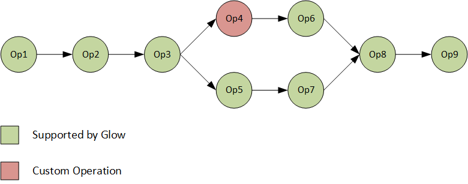
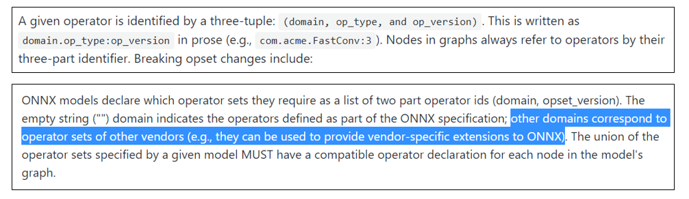
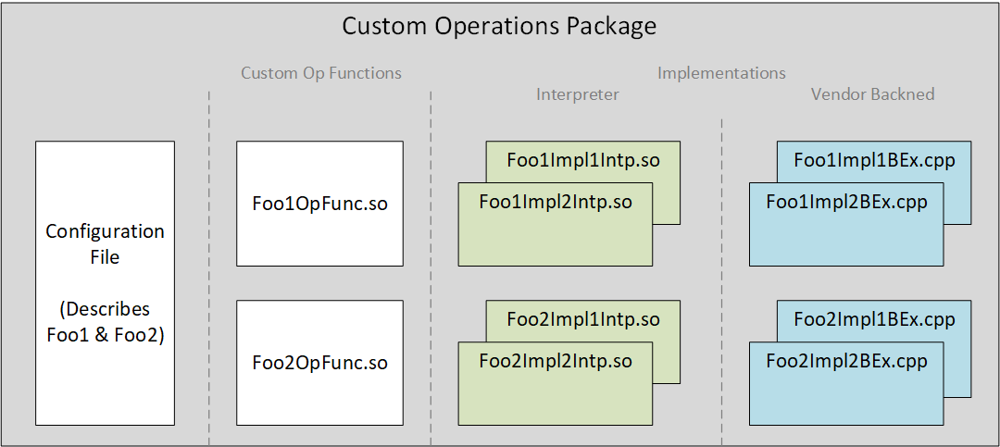
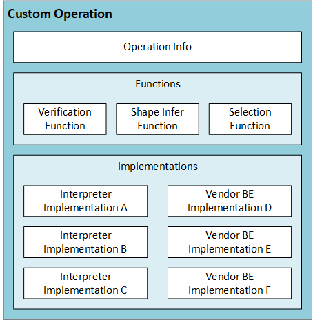
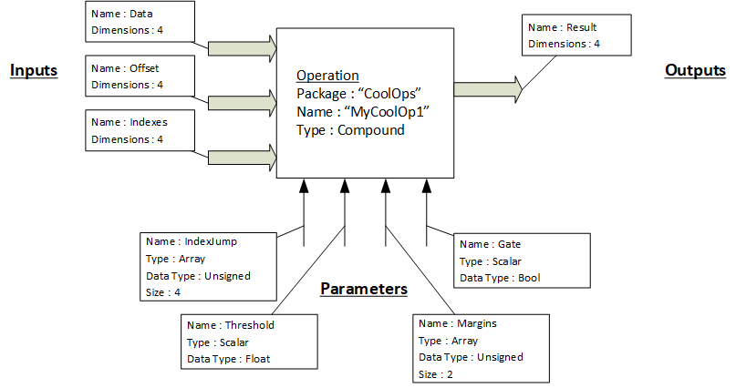
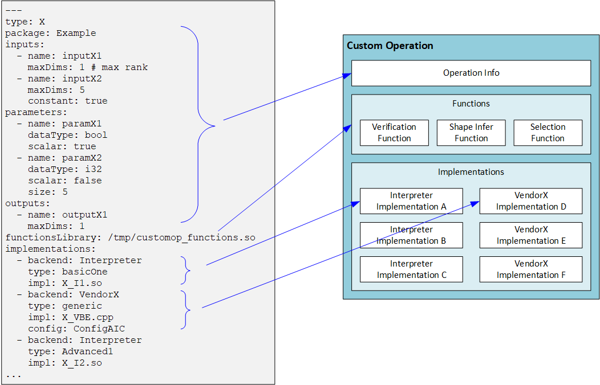
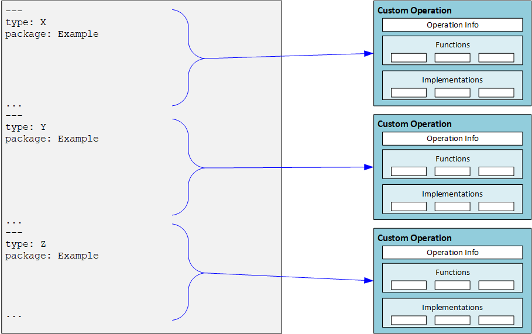
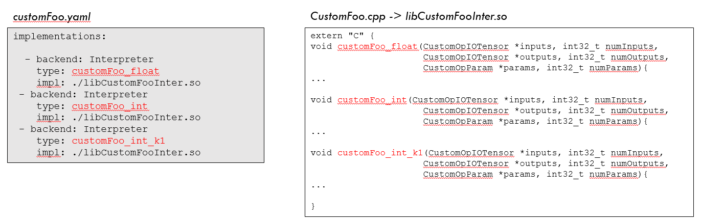

## External Custom Operations

### Overview 
The concept of custom operation is to allow a user to add an operation into the graph, which is new to Glow, e.g. not part of the operation set supported for the various models that the compiler knows to load and compile.
As will be described later in the document, with custom operations support the user can "register" a new operation prior to loading/defining the graph, and then use this new operation in the new graph created. Glow will use the registration information to create a Graph which can be compiled.

As an example, ONNX node definition supports "Domains". A user can create an ONNX model file which has nodes that come from the non-default domain, register these nodes definition in Glow, and then provide the model file to Glow.

### Custom Operations workflow
There are three high-level stages to create & work with a custom operation

__The first stage__ is to create the custom operation in one of the machine learning frameworks (such as pyTorch, TensorFlow, Caffe2, etc). After creating this operation, it is added to a machine learning model and the model is trained. The resulted model trained is stored for inference - either as ONNX file, Torchscript, TensorFlow savedmodel, or else.
For each framework/trained-model, the way to specify a custom operation is a bit different, and as such the way Glow knows to identify the custom operation varies.
Current version supports Custom Operations for ONNX Models and Composable graph API. More details on it below.

__The second stage__ is to prepare a package for the custom operation/s, which contains :
- The information needed for Glow to integrate the operations in the ML graph.
- Implementations to be used when compiling the graph to a binary.
The content of this stage is explained in details on next chapters.

__The third stage__ is compilation. In order to compile a model that has the custom operation inside, the operation package needs to be registered first. After successful registration, the model can be loaded by any one of Glow Model loaders, pending on adding support for it in the model loader.
Currently ONNX & pyTorch model loaders were extended to support custom operations.

#### Custom Operation in ONNX

ONNX Format is designed to be extended by custom operators. The Node Proto description contain a "domain" especially for this purpose.

The following is taken from (https://github.com/onnx/onnx/blob/master/docs/Versioning.md) :

In order to add a custom operation to a model stored in ONNX container, the developer needs to add an operator which does not belong to the default domain, e.g specify a value in the domain. Once such an operator (with a non-default domain) exists in the ONNX model, Glow will treat it as a custom operation, and check if its registered.

### Custom Operation package
The custom operation/s package is prepared by the developer, and contains all files needed to register operation/s within the compiler.

As described on previous section, the developer created a custom operation in a machine learning framework, and used it to train a model, and export a model with this custom op. The files in the custom operations package are used by Glow to compile that model into a binary.

The drawing below shows the content of a package, and the next sections describe each component in details.

Briefly :
- The configuration file describes the operations and related files, and is used by Glow to "bootstrap" the package, registering its content within the compiler.
- Custom Op Function files (Foo1OpFunc.so, Foo2OpFunc.so) contain utility functions used by the compiler during compilation of the model.
- Implementation files contain the implementations of the operations for different compilation targets. Also, per operation it is possible to provide multiple implementations (selected by the "selection" function - see below)

#### Modeling a custom operation
To better understand the content of the package, this section briefly discusses what is needed to model any machine learning operation, so that it can be placed in a graph and compiled.
The folloiwng drawing shows modeling of one operation :

**Operation Info** block represents the modeling of the operation itself as a "black box" which needs to be connected inside a graph. In order to do that, need to provide basic information on the operation (name, type), as well as describing the inputs, outputs and parameters of the operation.

Any operation in a machine learning graph (not just custom operations) can be modeled by defining its set of inputs, outputs and parameters.
The inputs and outputs are tensors. Inputs come from the operation/s before this one, and outputs are the tensors created by the operation, and provided to the operation/s that come afterwards.
For the inputs and outputs, the developer needs to specify the maximal rank supported by the operation. The actual values per dimension will be populated by the compiler during graph creation
Parameters are the constant values provided to the operation as part of the configuration - for example, kernel size, alpha value, etc.
Parameters can be scalar (single value) or a vector of values.

In addition to the Operation Info, the modeling of the operation includes a collection of utility functions and implementations.

**Utility functions** help the compiler during the compilation. The developer is required to implement the following functions :
- Verification function : receives a set of inputs, outputs and parameters, populated with actual values that the operation is going to work on. The function should validate that the values are correct and the operation can support this combination.
- Shape inference function : receives a set of inputs and parameters, populated with actual values that the operation is going to work on. The function is doing shape inference of the outputs : e.g. it returns what will be the tensor size on each dimension.
- Selection function : receives a set of inputs, outputs and parameters, populated with actual values that the operation is going to work on. In addition it receives the compilation target - for example,  Interpreter. The function returns a string containing the name of the adequate implementation to use for this configuration. More details on that below.

#### Configuration File
The configuration file is part of the custom operation package provided by the developer. There is a single configuration file which provides the required information for all operations in package.
The file is YAML formatted. Below is an example of a configuration file for a single operation :

Each operation section has the following :
- Operation Info, defining the operation name, type, inputs, outputs and params
    - For each input / output, the relevant fields are the name and maxDims (maximal rank of the tensor)
    - For input, there is also optional constant field, which can be true/false, to indicate if it is a constant.
    - For each param, the relevant fields are name, datatype (bool/float/int), scalar (true/false).
    - If param scalar field is false, meaning this is an array (1d vector), and then need to provide "size"
- Location of the custom operation functions
- Implementations

The information provided per implementation is :
- target Backend.
- type : used by the backend during selection process (see explanation next).
- impl : location of the implementation file.
- config (optional) : additional information on this implementation, to be used by the backend.

The configuration file can provide the information for multiple operations. in this case, each operation is defined in a separated YAML section. Below is an example for how such configuration file would look like :

#### Custom Operation Functions
The developer is required to provide a shared library which has three functions : Verification, Shape inference and selection.
The path to the shared library, as well as the library name, is specified in "functionsLibrary" field of the configuration file.

The API of these functions is C, and defined in _CustomOpFunctions.h_. The types used are defined in _CustomOpTypes.h_

##### Verification Function
The verification function is used by the compiler at graph construction stage, to validate that the custom operation implementation supports the combination of inputs, outputs and parameters.

     bool customOpVerify(CustomOpIOTensor *inputs, int32_t numInputs,
                      CustomOpIOTensor *outputs, int32_t numOutputs,
                      CustomOpParam *params, int32_t numParams)

##### Shape Inference Function
The shape inference function is used by the compiler at graph construction stage to receive the output dimensions expected by the custom operation.

In some models, specifying the output dimensions is optional. As such, the compiler has no way to known what will be the output dimensions of a custom operation (for internal known operations, it has shape inference functions)

The function receives the input dimensions and parameters, and is expected to fill in the correct output dimensions.

     bool customOpInferShape(CustomOpIOTensor *outputs, const int32_t numOutputs,
                         const CustomOpIOTensor *inputs, const int32_t numInputs,
                         const CustomOpParam *params, const int32_t numParams)

##### Selection Function

By design, the Custom Op functionality allows user to provide multiple implementations suitable for different configurations.

For example, provide implementation for float vs one for integer, provide specialized implementation for specific parameter value, etc.

The developer implements this function to return the adequate "flavor" of custom op implementation based on the node configuration (inputs, outputs, parameters)
The returned string represents the flavor. Used by the Backend Op repository to select the proper implementation based on configuration info (see details on config info)

     const char *customOpSelectImpl(CustomOpIOTensor *inputs, int32_t numInputs,
                                CustomOpIOTensor *outputs, int32_t numOutputs,
                                CustomOpParam *params, int32_t numParams,
                                const char *backend)

#### Custom Operation Implementations

The developer is required to provide suitable implementations for the compilation targets (Interpreter, Other Supported Backends) and correctly register them in the configuration file.

This section describes the implementations signatures and relation with the configuration file. The SDK comes with custom op examples which show how such implementations look like, and how do they get build.

##### Interpreter Implementation
The interpreter implementation is provided to the compiler as a shared library (or collection of shared libraries). Each shared library can contain multiple versions (flavors) of implementations of the operation, refered onwards as "kernels". A kernel is selected at model compilation time by the selection function.
The developer is responsible for compilation of these shared libraries. As the interface is C, the shared libraries can be compiled by various compilers (GCC, CLANG, etc). In addition, as these shared libraries are running on the Host CPU, the developer can open files, dump results, use stdout/stderr for printing debug messages, etc. This makes the Interpreter implementation a very effective way for debugging the operation functionality as part of model execution.

The signature of the kernel (implementation) is generic, and fits any custom operation. It contains array of input tensors, array of output tensors, and array of parameters.

     typedef void (*customOpInterpreterKernel_t)(
                         CustomOpIOTensor *inputs, int32_t numInputs,
                         CustomOpIOTensor *outputs, int32_t numOutputs,
                         CustomOpParam *params, int32_t numParams)

- The signature is defined in [CustomOpInterpreterInterface.h](https://github.com/pytorch/glow/blob/master/include/glow/CustomOp/CustomOpInterpreterInterface.h)
- The relevant types defined in [CustomOpTypes.h](https://github.com/pytorch/glow/blob/master/include/glow/CustomOp/CustomOpTypes.h)

Note that the order of inputs, outputs and parameters has to match the order defined in the configuration file. During the model compilation, the compiler is organizing the inputs, outputs and params passed to the kernel based on that order.

When creating an implementation, the developer needs to create a kernel (or multiple kernels) which has the signature as above and compile it into a shared library. For example :

     void customFoo (CustomOpIOTensor *inputs, int32_t numInputs,
                     CustomOpIOTensor *outputs, int32_t numOutputs,
                     CustomOpParam *params, int32_t numParams)  {
      // Foo implementation is here
      }

The next section explains how the mapping between library / kernel name and compile-time selection is happening.

__Configuration information and implementations__

The Compiler uses the information in the _implementations_ section of the configuration file, together with the developer's provided selection function, to allocate the proper implementation/kernel and use it.
When the target is interpreter, and the compiler encounters a custom operation, it does the following:
- Calls the selection function.
- Based on returned string, looks for the specific implementation in the _implementations_ section, by trying to make the _type_ field of each.
- Once found, opens the shared library which appears under _impl_ field.
- Next, tries to get a function pointer (using dlsym()), using the name specified in type.

As such, developers needs to make sure that the kernel names in the code/shared-library match the string appears in the type field

### Adding custom op support for a Backend

1. Define the implementation details that need to be registered and the
   interface for kernel.

    CustomOp implemenentation details are represented by the class [ImplementationInfo](https://github.com/pytorch/glow/blob/master/include/glow/Graph/OperationInfo.h#92) which is part of OperationInfo that is registered. ImplementationInfo has the backend name, type of implementation, backend-specific config and the implementation itself.

    The fields type, config and implementation and their interpretation is backend-specific and needs to be defined by the Backend.

    For e.g. for Interpreter backend the kernel implementation functions are compiled into a [shared library](https://github.com/pytorch/glow/blob/master/tests/unittests/CMakeLists.txt#684). The implementation `void*` in this case points to the path to the shared library and the `string type` is name of the function. There is no backend specific config for Interpreter at the moment.
    The kernel interface is defined here.
    - [Interpreter Kernel Interface](https://github.com/pytorch/glow/blob/master/include/glow/CustomOp/CustomOpInterpreterInterface.h?autodive=0%2F%2F%2F%2F)
    - [Interpreter Kernel Implementation Example](https://github.com/pytorch/glow/blob/master/tests/unittests/CustomReluImpl.cpp#102)

2. Implementation Selection Function

   For different input, output types different implementation might be required. In order to facilitate this, multiple implementations for the same backend can be registered. The field `type` of the ImplementationInfo can be used to identify an implementation. To decide which implementation needs to be used a selection function is also registered for each custom op. This function takes in the type of inputs and outputs and parameter values and returns the type of implementation that should be used.
   - [Selection Function Interface](https://github.com/pytorch/glow/blob/master/include/glow/CustomOp/CustomOpFunctions.h?autodive=0%2F%2F%2F%2F)
   - [Example Selection function](https://github.com/pytorch/glow/blob/master/tests/unittests/CustomReluImpl.cpp#69).

3. Implement [BackendOpRepository](https://github.com/pytorch/glow/blob/master/include/glow/Backend/BackendOpRepository.h#31) for the backend.

    BackendOpRepository is responsible for interpreting the implementations that have been registered for the custom op and sharing it with Backend. OpRepository registers the implementations and the selection function with the BackendOpRepository. BackendOpRepository conducts sanity checks and processes the ImplementationInfo as it may see fit. When Backend executes the custom op it queries the BackendOpRepository with the input, output types and parameter values to get the right implementation.

    An example implementation for BackendOpRepository is the  [Interpreter BackendOpRepository](https://github.com/pytorch/glow/blob/master/include/glow/Backends/Interpreter/InterpreterOpRepository.h). At registeration, the BackendOpRepository loads the shared library and finds the symbols for implementation functions and stores them. At a later point, it provides the implementation to the backend.

4. Extend [Backend::isOpSupported()](https://github.com/pytorch/glow/blob/master/lib/Backends/Interpreter/Interpreter.cpp#730) to indicate support for CustomOp

5. Implement the CustomOp Instruction execution

    The input and output operands can be retrieved from the Instruction, just like any other op. The parameter values are embedded as MetaData in the instruction. The BackendOpRepository can then be used to get the implementation that needs to be called.
    Example of [Interpreter Backend](https://github.com/pytorch/glow/blob/master/lib/Backends/Interpreter/InterpreterNodes.cpp#6730).
