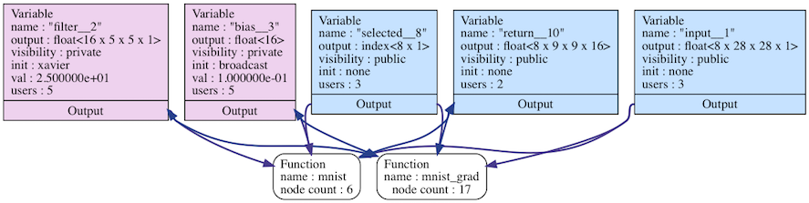
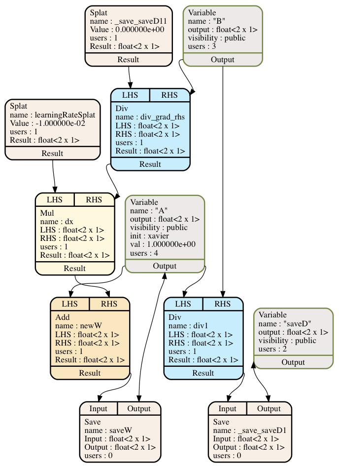
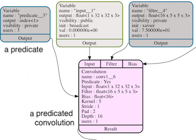

## Design of the Glow Intermediate Representation

### Introduction

This document describes the motivation behind the Glow intermediate
representation (IR) and some implementation details.

Glow is a retargetable compiler that supports a number of different backends.
This means that the first few layers of the compiler are target-independent, but
as you get closer to the different backends things start to diverge.  The first
two levels of IR are shared between all targets. Different backends may have
additional layers of IR.

### High-level IR

The high-level IR is a dataflow node-based graph representation that is similar
to a graph that you may find inside Caffe or in ONNX format. When we load a
neural network model from some file we construct this graph with a direct
translation of one operator to one or more nodes. The high-level IR is a simple
graph that allows basic transformations such as replacing all uses of some node
with another node and modifying the content of constant nodes. The graph is
strongly typed, which means that inputs and output have a known tensor type
(consisting of the tensor's shape and element type), and that the types of nodes
are verified by the compiler. For example, the element-wise add instruction must
operate on operands of the same type.

The Glow graph is structured as a module that contains multiple functions that
contain multiple nodes. Placeholders and Constants, which are similar to global
variables in C programs, are nodes that are shared between the functions. Nodes
inside functions are able to reference Placeholders and Constants which are
owned by the module. A module may have multiple functions. For example, one
module could contain both an inference function and the gradient of that
inference function. The gradient function could perform training of the
placeholder weights, and the inference function could read from those same
weights.



Glow functions contain nodes that represent the different operations of a neural
network. The function owns the nodes and has access to the placeholders and
constants in the module. The image below depicts the compute graph that
represents the expression "A / B". The graph is automatically differentiated by
Glow, and the value of variable A is updated with the gradient of the
expression. Glow lowers the nodes that compute the gradient of the expression
and the stochastic gradient descent (SGD) node into a sequence of low-level
operators (Div, Mul, Add and Save). The different compiler backends do not need
to implement support for the DivGrad, ReLUGrad or SGD nodes.

<p align="center">

</p>

The compiler has a debug method for dumping a graphical representation of the
graph into a dotty file. The method is called 'dumpDAG'. The images above were
generated with this method. The textual representation of the graph is less
informative and it looks like this:

  ```
  pool
  name : "pool"
  input : float<8 x 28 x 28 x 16>
  output : float<8 x 9 x 9 x 16>
  kernel : 3
  stride : 3
  pads : [0, 0, 0, 0]
  kind : max

  convolution
  name : "conv"
  input : float<8 x 9 x 9 x 16>
  output : float<8 x 9 x 9 x 16>
  filter : float<16 x 5 x 5 x 16>
  bias : float<16>
  kernel : 5
  stride : 1
  pads : [2, 2, 2, 2]
  depth : 16

  relu
  name : "conv"
  input : float<8 x 9 x 9 x 16>
  ```

After optimizing the graph with target-independent optimizations the code is
lowered into the mid-level IR in a phase that's called "IRGen" (stands for IR
generation). This is a one-to-many translation where each operator is translated
into one or more instructions.

### Constants

Constants are special nodes that represent tensors that are a part of the graph.
These nodes can be used to represent things like the weights of neural networks.
Constants are immutable during the execution of the program, but graph
optimizations can access the constants and modify them. This feature is useful
for transformations that prepare the weights by transposing them or quantizing
them before the execution of the program.

### Placeholders

Placeholders are symbolic nodes that are not backed by a concrete tensor during
the compilation of the program. Inputs and outputs of Glow programs should be
modeled using Placeholder nodes. Concrete tensors are attached to placeholder
nodes during the compilation of the program, and not before. This means that
unlike constants, the optimizer can't inspect or mutate the content of
Placeholder nodes. The same program could be compiled using different bound
tensors without changing the semantics of the program.

### Variable Mutability

During IRGen, constants and placeholders are converted into WeightVars. These
WeightVars are annotated with Mutable or Constant labels, depending on the
source and whether the weights are modified during the execution of the program.

### Predicates

Predication is a well-known technique to control the execution of some node or
instruction by means of a boolean flag. If the value of the flag at runtime is
set to 'false' then the predicated node or instructions may return any value.

Glow's approach to predication is to support it as an optimization. In other
words, if honoring the predicates does not give a performance boost, then
a backend is free to ignore them. As such predication **cannot** be used
to model control flow, since potentially the last write could win.
Therefore input graphs must correctly execute with predicates ignored.
For instance, when ignoring predicates, a program should be free of
divisions by zero and other things that would lead to
an abnormal termination of the program. Another example would be,
in training mode, the memory used in predicated training nodes should be
initialized to zero to make sure the program will not use uninitialized
memory to update the weights, if the predicates get ignored.

The type of the flag must be
a boolean value or a vector of booleans that matches the batch size. Predicates
could accelerate the performance of some networks by avoiding some
computation. It can particularly be useful when applied to Recurrent Neural
Networks, because different elements of the batch may have different lengths and
do not need to perform the same amount of computation.



### Node Lowering

Instead of compiling high-level operators directly, Glow performs "node
lowering". In this phase, the compiler breaks the high-level operator nodes into
low-level linear algebra operator nodes. For example, the FullyConnected layer
is represented as a matrix multiplication followed by broadcasted add. Different
compiler backends do not have to implement the FullyConnected layer and a dozen
other high-level opcodes, just the low-level matrix multiplication.

This lowering phase drives many of the design decisions of the compiler. In
Glow, lowering is performed as part of the high-level graph as described above,
prior to moving to low-level IR. This is due to a number of reasons. First, the
new lowered graph may allow for additional graph-level optimizations. Second,
the new graph structure may affect the decisions of the instruction
scheduler. And third, after lowering we allow the backends to perform additional
target-specific optimizations on the lowered graph.

The lowering phase comes after the graph is differentiated. Because the lowering
transformation does not preserve the semantics of the graph, it is not possible
to differentiate the graph for certain operators. For example, the Regression
node (which produces gradient when optimizing total squared error) becomes a
no-op for the inference case, but is translated into an element-wise subtract
for the training case. Performing the lowering before differentiation would
prevent us from performing the correct lowering of the Regression node.


### Low-Level IR

After optimizing the graph with target-independent optimizations, and lowering
from high-level operator nodes to linear algebra operator nodes, the code is
further lowered into the low-level IR in a phase that is called "IRGen" (which
stands for IR generation). This is a one-to-many translation where each
high-level node is translated into one or more instructions.

The low-level IR enables a different kind of target independent optimizations
that are not possible with the high-level graph format. This is an
instruction-based representation that operates on tensors that are referenced by
address. This gives the compiler the ability to perform low-level memory
optimizations that are not possible at the high-level, because memory is not
represented directly. An example of such a transformation is the optimization
that allows certain operations to transform some buffers in-place, such as
element-wise arithmetic.

In the context of hardware acceleration, the low-level instruction-based
representation allows the compiler to represent device-specific operations such
as asynchronous DMA operations. Hiding the latency of memory operations is
important for utilizing the execution units of the hardware effectively, and the
instruction-based representation allows the compiler to create a schedule that
hides the latency of the memory operations.

The IR is strongly typed and each instruction operand kind has known parameter
types. The IR is not Static Single Assignment (SSA) based representation,
because the IR does not support control flow. The IR is strongly typed and each
instruction operand kind has known parameter types. It is designed to be used as
an in-memory form, though can be dumped to human readable assembly-like format.

A function in IR form contains two sections: 'declare' and 'program'. In the
first section of the IR we declare a number of memory regions that live
throughout the lifetime of the program. This is similar to global variables in
C. The second part of the IR is a list of instructions. Each variable is
annotated with the kind of initialization that the program should do.

There are two kinds of memory regions which correspond to these two sections:
global memory regions (found in 'declare') and locally allocated regions (found
in 'program'). The locally allocated memory regions are similar to 'alloca' in
LLVM IR. Memory regions are strongly typed, which means that the kind of type of
tensor that the region represents is known.

Instructions operate on either global variables or locally allocated
buffers. Each operand is annotated with one of the qualifiers
'@in'/'@out'/'@inout'. '@in' means that the buffer is read from. '@out' means
that the buffer is written into. And '@inout' means that the instruction may
read and write into the buffer. These operand qualifiers help the optimizer
decide when it is legal to perform certain optimizations, such as copy
elimination or buffer sharing. Instructions may have other attributes that
specify the legality of some optimizations. For example, some instructions
require that the data from the forward pass would be kept around for the
backward pass, so if the program is not optimized for inference-only mode then
certain memory optimizations cannot happen.

Below is an example of unoptimized Glow IR. Note that the 'alloc' instruction
does not allocate memory; it just marks the lifetime of the activation. The
low-level memory allocator is responsible for allocating all of the buffers into
a single coalesced region.

  ```
  declare {
    %input = weight float<8 x 28 x 28 x 1>, broadcast, 0.0
    %filter = weight float<16 x 5 x 5 x 1>, xavier, 25.0
    %filter0 = weight float<16>, broadcast, 0.100
    %weights = weight float<10 x 144>, xavier, 144.0
    %bias = weight float<10>, broadcast, 0.100
    %selected = weight index<8 x 1>
    ...
    %result = weight float<8 x 10>
  }

  program {
    %allo = alloc float<8 x 28 x 28 x 16>
    %conv = convolution [5 1 2 16] @out %allo, @in %input, @in %filter3, @in %bias0
    %allo0 = alloc float<8 x 28 x 28 x 16>
    %relu = relu @out %allo0, @in %allo
    %allo1 = alloc index<8 x 9 x 9 x 16 x 2>
    %allo2 = alloc float<8 x 9 x 9 x 16>
    %pool = pool max [3 3 0] @out %allo2, @in %allo0, @inout %allo1
    ...
    %deal6 = dealloc @out %allo6
    %deal7 = dealloc @out %allo7
    %deal8 = dealloc @out %allo8
    %deal9 = dealloc @out %allo9
  }
  ```

### The Lifetime of a Glow Instruction

This is a high-level overview of the compilation process:

1. The graph is either loaded via the graph loader (from ONNX or Caffe2 format),
or constructed via the C++ interface.

2. The graph is differentiated if needed.

3. The graph is optimized.

4. Linear algebra node lowering takes place.

5. Additional rounds of optimizations occur, both target independent and target
specific.

6. The graph is scheduled into a linear sequence of nodes that minimizes memory
usage.

7. IRGen converts the low-level graph into instructions.

8. Low-level IR optimizations are performed.

9. Backend-specific optimizations and code generation are performed.

