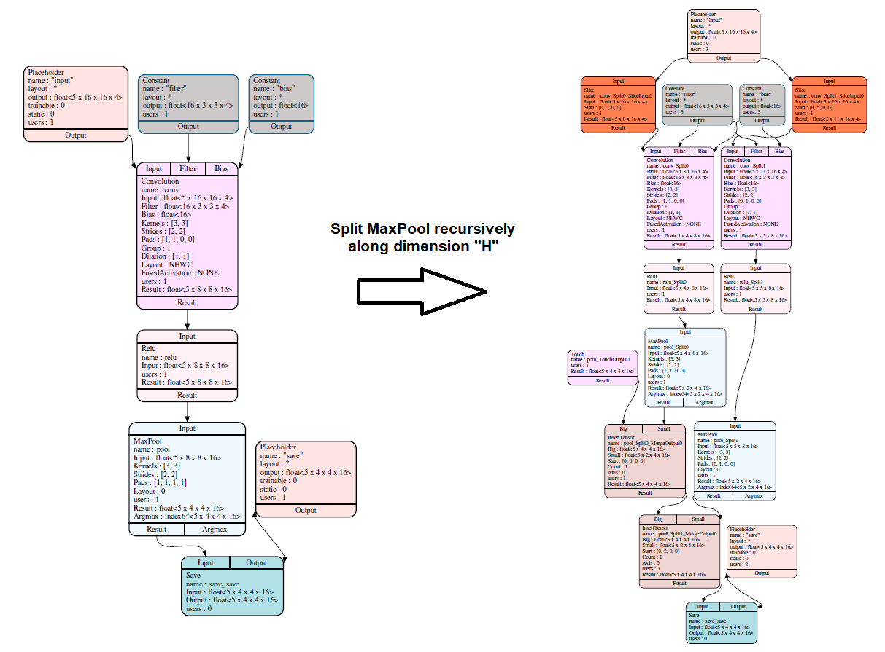

## NodeSplitting

NodeSplitting is a set of utility functions used to perform node splitting at graph level. Splitting
nodes in multiple smaller nodes has the following benefits:
- Allows a higher degree of parallelization when computing a larger operator by means of splitting in
  multiple smaller chunks.
- Creates subgraphs which locally have a smaller memory footprint than the initial graph thus making
  these subgraphs more suitable for memory constrained devices, e.g. accelerators which work directly
  only with a small internal RAM.

The node splitting procedure can be performed either using targeted `options` which specify explicitly
how a node should be split and/or using `constraints` which can provide additional constraints to the
splitting process (e.g. memory based constraints).

The split procedure for a node is implicitly defined relative to the first output operand which means
that all the split parameters refer to the first output operand of the node being split.

After splitting the original node is automatically removed from the graph.

The node splitting options can be either to split a node in `orthogonal` pieces or `non orthogonal`
when an overlap is required between the operands. The split procedures have the following options:
- `SplitNodeByNumChunks` - Orthogonal split option for splitting a node along specified dimensions
  with the given **number of chunks** for each dimension. For example `SplitNodeByNumChunks({1}, {10})`
  specifies a split along dimension 1 in 10 equal chunks.
- `SplitNodeByChunkSize`- Orthogonal split option for splitting a node along specified dimensions
  with a given **maximum chunk size** for each dimension. For example `SplitNodeByChunkSize({1}, {10})`
  specifies a split along dimension 1 in equal chunks with maximum chunk size equal to 10 units.
- `SplitNodeByChunkSizes` - Orthogonal split option for splitting a node along specified dimensions
  with the exact **array of chunk sizes** for each dimension. For example `SplitNodeByChunkSizes({1}, {{3, 4, 5})`
  specifies a split along dimension 1 in chunks with the exact given sizes: 3, 4 and 5 units.
- `SplitNodeByChunkWeights` - Orthogonal split option for splitting a node along specified dimensions
  with the given **chunk weights** for each dimension such that chunk sizes will be proportional to the
  chunk weights. For example when splitting a 1D tensor with size 10 using the option `SplitNodeByChunkWeights({0}, {1, 4})`
  we obtain two chunks with sizes 2 and 8.
- `SplitNodeBySliceRanges` - Non-orthogonal split option based on raw slice ranges defined for the output
  operand of a node. The slice ranges are allowed to overlap but must cover the entire output operand of
  the node being split. This is the most flexible and generic split option. For example `SplitNodeBySliceRanges({{0, 4}}, {{2, 5}})`
  specifies the split of a 1D array of length 5 in two overlapping regions: first between 0 and 4 and a
  second between 2 and 5 (intervals are specified as half-open intervals).

The node splitting tool set includes functions to split a single node or multiple nodes at once.

The node splitting tools are part of the graph optimizer and can be found here:
- `include/glow/Optimizer/GraphOptimizer/NodeSplitting.h`
- `lib/Optimizer/GraphOptimizer/NodeSplitting.cpp`

### Recursive splitting

A more powerful capability is to perform a recursive split that is starting from a node and traversing
the graph along the depth towards the parent nodes while splitting using the same boundaries such to
obtain subgraphs which are completely parallel. Below you can see an example for a recursive split for a
simple network containing a Convolution node, a Relu and a MaxPool. The recursive split is performed
starting with the MaxPool node using:
- a split option to split along the Height dimension in 2 chunks (layout for all tensors is assummed NHWC)
- a split max depth of 3
The result is that we obtain 2 completely separate subgraphs:

