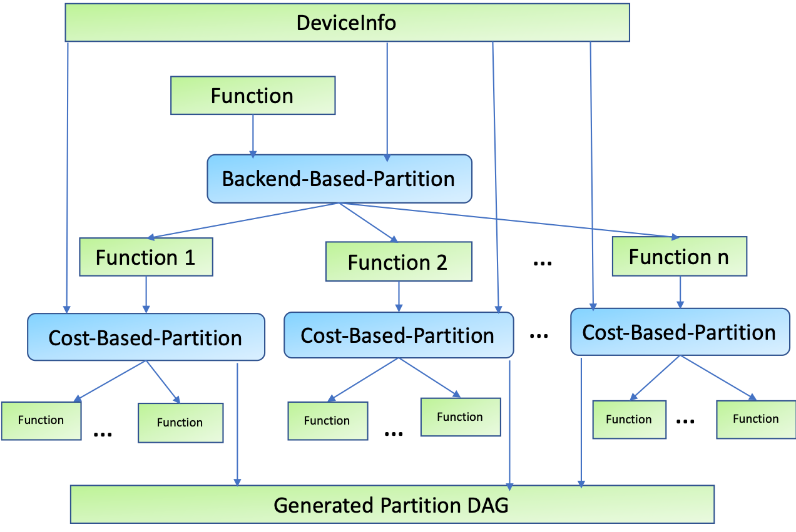
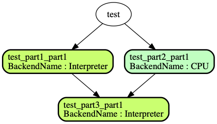
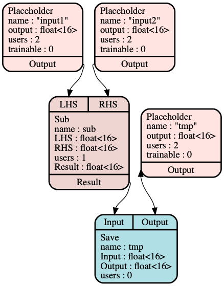
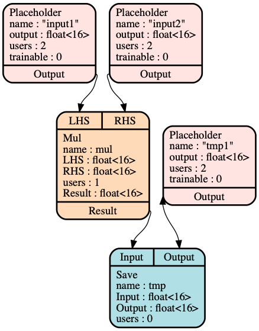
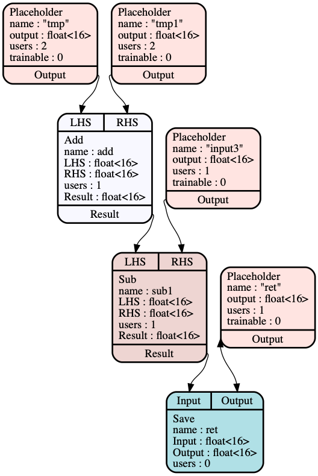

## Graph Partitioning Support in Glow

### Overview
Along with the increased size of neural networks, a large network may not be able to run on only one accelerator/device due to resource limitation (e.g. memory capacity). Therefore, it is necessary to divide up the network into several sub-networks and each of them can be executed on one accelerator. In addition, even if a networks fits a signal card, spliting the network may improve peformance via model parallesim. This problem can be abstracted as a [Graph Partition problem](https://en.wikipedia.org/wiki/Graph_partition) : Given a neural network and n devices, we would like to split this network into minimal k sub-networks (where k <= n) , and for each sub-network, it can be run on one device with the device resource restriction.

### Heterogeneous partition
Glow now supports Heterogeneous Partition to address this problem. Given a network, and the information of a list of devices proviced by users, Glow will try to find a posssible partition or report an error.

#### Design
The figure below shows the Heterogeneous Partition flow: a network(i.e. Glow function) is first divided up into sub-networks based on backend types and then each sub-network is divided up based on given cost model.


For Backend-Based-Partition : If a node/operator is only supported by backend A, it will be assigned to A. If a node is supported by both backends A and B, Glow chooses the one with higher priority. In addition, users can define backend-support/backend-unsupport op list. This feature allows users to run one network cross different type of backends. E.g. users can choose any node running on their accelorator and the rest running on CPU.

#### Usage
[```struct DeviceInfo```](https://github.com/pytorch/glow/blob/master/include/glow/Runtime/RuntimeTypes.h#L50) is required to run Partitioner. [Here](https://github.com/pytorch/glow/blob/master/tests/unittests/PartitionerTest.cpp#L614) is an exmpale of how to call heterogeneous partition.
If Glow ExecutionEngine is used to compile and run a model, users need to provide the config in a yaml file (e.g. [yaml file sample](https://github.com/pytorch/glow/blob/master/tests/runtime_test/heterogeneousConfigs.yaml)) and EE will read it and create the DeviceConfig. This is an example:
```
./bin/image-classifier tests/images/imagenet/*.png -image-mode=0to1 -m=resnet50 -model-input-name=gpu_0/data -cpu-memory=100000 -load-device-configs="tests/runtime_test/heterogeneousConfigs.yaml"
```

Note: Please keep in mind that the device config file is **order-sensitive**. If a backend A is written before B and both backend A and B support a specific node, Glow always chooses the node to the backend A.   For instance, an interpreter backend supports more operators than the OpenCL backend. Glow assigns all nodes to the interpreter if it's put before OpenCL in device config.

### User-defined partition
Glow also supports user-defined partition. This feature gives user the full control of partitioning. Given the partition configuration, which should be represented as [```struct PartitionConfig```](https://github.com/pytorch/glow/blob/master/include/glow/Runtime/RuntimeTypes.h#L181), Glow generates the partition, and also validates the partition (memory constraint, number of partitions, and DAG). An example can be found [here](https://github.com/pytorch/glow/blob/master/tests/unittests/PartitionerTest.cpp#L977).

### Partition Debuggability

The partition log can be dumpped when the llvm option  ```-log-partition=true ``` is enabled. If ```-dump-partition=true``` is enabled, the graph of each sub-network will be dumpped into a list of dot files. The log contains the dot file of the final DAG, the info of each part and a list of dot files for sub-networks, as the following example shows.
```
[ RUN      ] PartitionerTest.SimpleHeterogeneousPartitioning
WARNING: Logging before InitGoogleLogging() is written to STDERR
I0828 15:55:28.063619 378844608 Partitioner.cpp:79] The number of partitions is : 3, and the DAG is dumped into DAG.dot file.
I0828 15:55:28.064260 378844608 PartitionerBase.cpp:171] Writing dotty graph for DAG after graph partitioning: DAG.dot
Writing dotty graph for Function to: partitionLogicalID1__test_part1_part1__Interpreter.dot
Writing dotty graph for Function to: partitionLogicalID0__test_part2_part1__CPU.dot
Writing dotty graph for Function to: partitionLogicalID1__test_part3_part1__Interpreter.dot
I0828 15:55:28.065464 378844608 PartitionerUtils.cpp:494]    Partition 0:
                   Name :   test_part1_part1
               BackendKind :    Interpreter
               total Memory :   192
                     input size:    128
                 output size:   64
                 constant size: 0
               LogicalDeviceIDs :   1
I0828 15:55:28.065485 378844608 PartitionerUtils.cpp:494]    Partition 1:
                   Name :   test_part2_part1
               BackendKind :    CPU
               total Memory :   192
                     input size:    128
                     output size:   64
                 constant size: 0
               LogicalDeviceIDs :   0
I0828 15:55:28.065495 378844608 PartitionerUtils.cpp:494]     Partition 2:
                   Name :   test_part3_part1
               BackendKind :    Interpreter
               total Memory :   256
                     input size:    192
                     output size:   64
                     constant size:   0
              LogicalDeviceIDs :   1
[       OK ] PartitionerTest.SimpleHeterogeneousPartitioning (3 ms)
```

The figure below shows the genereated DAG:



The figures below shows the graph of each each sub-network after partitioning.

  
