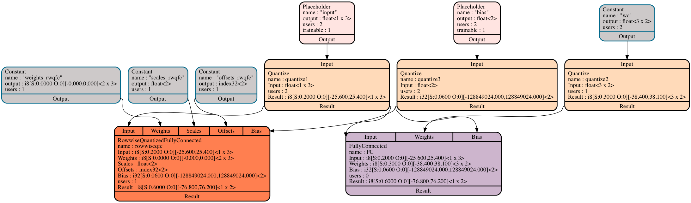

# Quantization in Glow

## Introduction

Quantization is the process of constraining an input from a continuous or
otherwise large set of values (such as the real numbers) to a discrete set (such
as the integers). In this context, Quantization is the process of converting
the inference phase of the neural network execution from floating point
arithmetic to integer arithmetic. Arithmetic using small integers is more
efficient than the computation of full-width floating-point numbers, and
additionally decreases memory usage.

This is an external [link](https://www.tensorflow.org/performance/quantization)
that explains how quantization is done in TensorFlow.

Glow is able to convert floating-point-based networks into signed 8-bit integer
networks. The canonical quantization representation is using signed integers,
though it is possible to support other quantization formats. Glow uses
profile-guided quantization, observing execution during inference to estimate
the possible numeric range for each stage of the neural network. Training-based
quantization is considered future work.

## Tensor Representation


In Glow, tensors are typed and can represent floats, quantized
non-floating-point values such as currently supported Int8 (8-bit signed
integers), and index types. A quantized tensor's type is made up of the
underlying element type (Int8), as well as the possible range of the values in
the tensor using 'scale' and 'offset' fields. To convert from the 8-bit integer
range of [-128..127] to the floating-point number that they represent, Glow uses
the following conversion formula:

  ```
    value = (input - offset) * scale
  ```

Activations, weights, and variables all use the same type-system and represent
information in a uniform way.

## Network Conversion

Different parts of the network contain floating-point values in different
ranges. In some parts, the typical range of the numbers is between zero and one,
while in other parts of the network the possible range is in the
hundreds. Choosing a single conversion scale for the whole network would not
work, because a single scale value could be imprecise for small values and
truncate large values.

We use profile-guided information to estimate the possible numeric range for
each stage of the neural network. Our quantization conversion works using a
two-phase process. First, we statically instrument the network with special
profiling nodes that record the ranges of activations that flow in the network,
optimize the network including these profiling nodes, and then run
inference. Then, we recompile the network using this profile information to
convert the network into a quantized form, allowing for static optimization of
the quantized graph. We convert portions of the network into islands of integer
computation and aim to generate outputs in the range that the original
floating-point network produces. During the conversion, for the following types
of quantized nodes, we ignore the output's quantization params (if they are
provided) and force the output have the same quantization params as the input
for performance purpose:
```
LocalResponseNormalizationNode
SliceNode
ReshapeNode
TopKNode
GatherNode
MaxPoolNode
```

The figure below shows a quantized subgraph from Resnet50.


### How to perform NN conversion

The Glow loader tool provides options to execute both profiling and conversion of a NN graph.

```dump-profile=profile.yaml``` option is used to dump per node's output profile data
into the ```profile.yaml``` file.
This information can be used in the process of quantized conversion.
For example, you can run the following command to capture profile for Resnet50.
```
./bin/image-classifier tests/images/imagenet/*.png -image-mode=0to1 -m=resnet50 -model-input-name=gpu_0/data -dump-profile="profile.yaml"
```

By default, everything will be lowered for profiling. This allows for the
lowered components of nodes to be profiled, allowing for good precision of
complex nodes. For example, the `SigmoidCrossEntropyWithLogitsNode` has many
internal nodes that it is lowered to. Without profiling the internal nodes,
there would be no information on how best to quantize its internal nodes that it
is lowered to.

Lowering all nodes may cause performance issues for some models, e.g. if a model
has group Convolutions which explode the size of the graph when lowered, leading
to long compilation and run time during profiling. Thus, we allow for disabling
certain NodeKinds for profiling. This means that during quantization, these
nodes should also not be lowered by the backend. This can be done using the
command line option `-do-not-lower-nodes-for-profiling` (note: multiple Nodes
can be listed via comma separation). For example:

```./bin/image-classifier tests/images/imagenet/*.png -image-mode=0to1 -m=shufflenet -model-input-name=gpu_0/data -dump-profile="shufflenet.yaml" -do-not-lower-nodes-for-profiling=Convolution```

The loader supports the following modes (or schemas) of quantization:

- ```asymmetric``` - maps the floating data to quantized ranges not necessarily
centered on 0. This is the default quantization schema.

- ```symmetric``` - maps the floating data to ranges centered on 0. In practice,
this means the symmetric schema may extend the range it needs to capture to make
sure 0.0 is at the center of that range. Therefore, this schema potentially wastes
some encoding space to enforce the symmetric property, but it comes with the 
property that the offset is always equal to zero.

- ```symmetric with uint8``` - produces ranges where the offset is always equal to
zero but allows the quantized ranges to be either int8 [-128; 127] or uint8 [0; 255].
In practice, this schema represents uint8 ranges using int8 ranges with an offset of
-128. Therefore, when using this schema, the produced profile will have two kinds of
ranges: one with an offset of 0 and the other with an offset of -128.

- ```symmetric with power of 2 scale``` - produces quantized ranges centered on 0
(symmetric) but also restricts the scale parameter to be a power of 2. Restricting
the scale parameter to be a power of 2 might result in a poor exploitation of the
quantized range (poor accuracy) but has the potential to provide a better performance.

Use ```quantization-schema=<schema>``` to specify the schema for the quantization
process, where schema will have one of the values:

- ```asymmetric```
- ```symmetric```
- ```symmetric_with_uint8```
- ```symmetric_with_power2_scale```

```load-profile=profile.yaml``` option is used to quantize graph based on the
captured profile in ```profile.yaml``` file. Important note, graph structure
should not be changed between a step of capturing profile and a step of quantizing
the graph.
For example, you can run the following command to load the profile and quantize
the graph.
```
./bin/image-classifier tests/images/imagenet/*.png -image-mode=0to1 -m=resnet50 -model-input-name=gpu_0/data -load-profile="profile.yaml"
```

By default, all nodes that can be quantized will be quantized. However, we may
only want to quantize some parts of a model, e.g. if accuracy loss is too high
when all node kinds are quantized. The Glow loader currently allows for
disabling quantization of all nodes of a specific kind which are found in the
graph. For example, if the loaded model sees high accuracy loss when
element-wise Add is quantized, it can be left in floating point. This can be
done by passing on the command line the node name via the option
`-keep-original-precision-for-nodes`. Multiple node kinds can be specified to
not be quantized. For example, to not quantize any Add or Div nodes when running
the quantized text translator:

```./bin/text-translator -m en2gr -load-profile=en2gr.yaml -keep-original-precision-for-nodes=Add,Div```

By default, target quantization precision is int8. However, precision can be
controlled via command line parameter: `quantization-precision`. There are
two supported values: `Int8` and `Int16`.

## Caffe2 Quantized Model Support

Glow is able to support Caffe2 Resnet50 quantized model:
https://github.com/caffe2/models/tree/master/resnet50_quantized

To support Caffe2 quantized models, Glow has:
- Supported additional quantized Caffe2 operators.
```
Int8Quantize
Int8Dequantize
Int8Conv
Int8ConvRelu
Int8MaxPool
Int8AveragePool
Int8FC
Int8SumRelu
Int8GivenIntTensorFill
Int8GivenTensorFill
```
- Supported int32 quantized bias.

In most of the cases, bias is quantized in int32 to improve precision
(the partial sum of the matrix-matrix multiplication is accumulated into int32,
so int32 bias can be added to the int32 partial sum for better accuracy).
Glow now supports int32 quantized bias in ```Convolution```, ```FullyConnected```
and ```RowwiseQuantizedFullyConnected``` nodes.

- Supported the conversion from uint8 quantized activations to int8 quantized activations.

For the quantized Caffe2 ops, the activations are quantized to uint8. In Glow, the
activations are quantized to int_8. Therefore, for the offset read from quantized Caffe2
model, we need to subtract 128(i.e. INT8_MIN) to make the activations become int8.

## Compiler Optimizations

Glow features a number of compiler optimizations that transform the compute
graph and make it more efficient. There are a few classes of optimizations and
parameters to optimize.

First, we attempt to minimize the number of conversions between floating-point
tensors and integer tensors, in both directions. Some operations, such as
'transpose' and 'concat' operate on both types, and changing the representation
can minimize conversions.

Second, the neural network contains 'rescale' nodes that change the range of the
integers. These nodes are required to convert between numeric ranges that mimic
the original floating-point network. However, in many cases, it is possible to
fold the rescale operations into numeric-producing operations, and eliminate
them.

Third, it's possible to rescale the values in the network in order to allow fast
hardware implementations of the quantized operations. For example, consider the
'max' operations. By converting both sides of the 'max' into the same scale we
allow the hardware to perform a simple comparison. By normalizing both sides of
the 'max' operation to the same scale we enable this efficient optimization.

For more specific graph optimizations check [here](Optimizations.md#quantization-specific-optimizations).

## Row-wise Quantization

Row-wise (or channel-wise) quantization is an important way to minimize accuracy
drop.  Glow supports row-wise quantized FullyConnected and
SparseLengthsWeightedSum nodes; They are enabled by the [model
loader](Testing.md#model-loader) option "-enable-rowwise".

For the regular quantized FC, we quantize the whole weights tensor with the same
scale and offset, which are computed based on the max and min of the entire
tensor.  But for row-wise, after getting ```min_i``` and ```max_i``` for each
row ```i```, we compute the pair of ```(scale_i, offset_i)``` to quantize each
element in row ```i```. The figure below shows the quantized FC node and
RowwiseQuantizedFullyConnected node. Instead of using only one tensor to
represent the quantized weights, we need 2 extra vectors ```Scales``` and
```Offsets``` to store the ```(scale, offset)``` for each row.




Row-wise quantized SparseLengthsWeightedSum is also supported. Similar to the
above, we compute scales and offsets per row, to be used with the `Data` input
for the `RowwiseQuantizedSparseLengthsSumNode`. Scales and Offsets are inputs to
the node. Output of this node is float, matching the Caffe2 implementation.

### Fused Row-wise Quantization

For some backends it may be beneficial to keep each row's scales and offsets
fused inline with the data. Caffe2 implements nodes with fused storage, such as
[SparseLengthsWeightedSum](https://caffe2.ai/docs/operators-catalogue.html#sparselengthsweightedsumfused8bitrowwise). Glow
supports such fused Nodes/Instructions, for example
`FusedRowwiseQuantizedSparseLengthsWeightedSum`. The `ElemKind` of fused tensors
is either `UInt8FusedQTy` or `UInt8FusedFP16QTy`. Tensors with these `ElemKind`s
are 2-dimensional, and have extra columns for each row to store scales and
offsets for that row. `UInt8FusedQTy` stores scales and offsets as float (so
there are 8 extra columns), while `UInt8FusedFP16QTy` stores them as float16_t
(so there are 4 extra columns). Note that similar to normal row-wise quantized
tensors, they use a dummy scale and offset in the Type.

### Conversion formula when using row-wise quantization

Some row-wise quantized operators prefer to use float offsets instead of
int32. For these operators, they use the following conversion formula:

  ```
    value = (scale * input) + offset
  ```

Operators using `UInt8FusedQTy` always use float offsets and this alternate
conversion formula. Nodes that use float offsets and this alternate conversion
formula are:

```
RowwiseQuantizedSparseLengthsWeightedSum
FusedRowwiseQuantizedSparseLengthsWeightedSum
```
