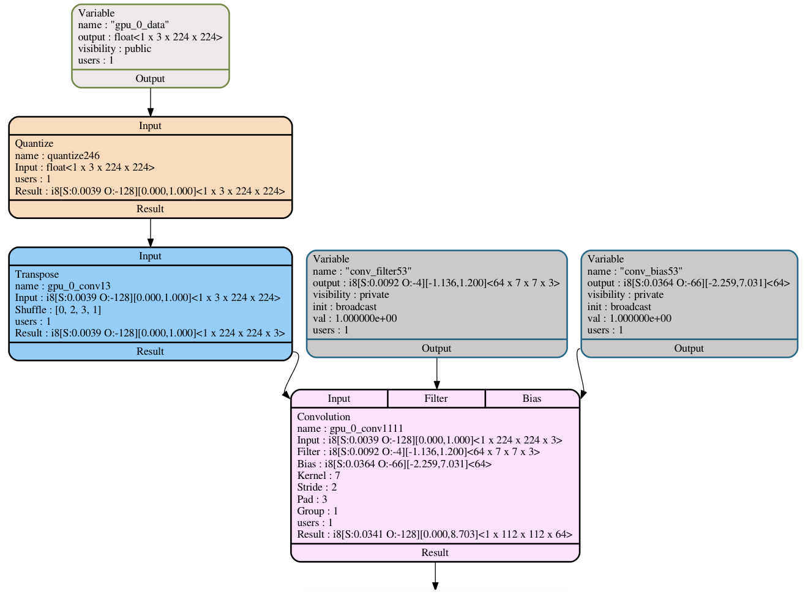

# Quantization in Glow

## Introduction

Quantization is the process of constraining an input from a continuous or
otherwise large set of values (such as the real numbers) to a discrete set (such
as the integers). In this context, Quantization is the process of converting
the inference phase of the neural network execution from floating point
arithmetic to integer arithmetic. Arithmetic using small integers is more
efficient than the computation of full-width floating-point numbers, and
additionally decreases memory usage.

This is an external [link](https://www.tensorflow.org/performance/quantization)
that explains how quantization is done in TensorFlow.

Glow is able to convert floating-point-based networks into signed 8-bit integer
networks. The canonical quantization representation is using signed integers,
though it is possible to support other quantization formats. Glow uses
profile-guided quantization, observing execution during inference to estimate
the possible numeric range for each stage of the neural network. Training-based
quantization is considered future work.

## Tensor Representation


In Glow, tensors are typed and can represent floats, quantized
non-floating-point values such as currently supported Int8 (8-bit signed
integers), and index types. A quantized tensor's type is made up of the
underlying element type (Int8), as well as the possible range of the values in
the tensor using 'scale' and 'offset' fields. To convert from the 8-bit integer
range of [-128..127] to the floating-point number that they represent, Glow uses
the following conversion formula:

  ```
    value = (input - offset) * scale
  ```

Activations, weights, and variables all use the same type-system and represent
information in a uniform way.

## Network Conversion

Different parts of the network contain floating-point values in different
ranges. In some parts, the typical range of the numbers is between zero and one,
while in other parts of the network the possible range is in the
hundreds. Choosing a single conversion scale for the whole network would not
work, because a single scale value could be imprecise for small values and
truncate large values.

We use profile-guided information to estimate the possible numeric range for
each stage of the neural network. Our quantization conversion works using a
two-phase process. First, we statically instrument the network with special
profiling nodes that record the ranges of activations that flow in the network,
optimize the network including these profiling nodes, and then run
inference. Then, we recompile the network using this profile information to
convert the network into a quantized form, allowing for static optimization of
the quantized graph. We convert portions of the network into islands of integer
computation and aim to generate outputs in the range that the original
floating-point network produces. The figure below shows a quantized subgraph
from Resnet50.



### How to perform NN conversion

The Glow loader tool provides options to execute both profiling and conversion of a NN graph.

```dump_profile=profile.yaml``` option is used to dump per node's output profile data
into the ```profile.yaml``` file.
This information can be used in the process of quantized conversion.
For example, you can run the following command to capture profile for Resnet50.
```
./bin/image-classifier tests/images/imagenet/*.png -image_mode=0to1 -m=resnet50 -dump_profile="profile.yaml"
```
By default, the loader will produce quantized results using asymmetric ranges.
That is ranges not necessarily centered on 0. The loader supports three modes
or schemas of quantization: asymmetric, symmetric, and symmetric with uint8. The symmetric schema
will always map the data on ranges centered on 0. In practice, this means
the symmetric schema may extend the range it needs to capture to make
sure 0.0 is at the center of that range. Therefore, this schema potentially
waste some encoding space to enforce the symmetric property, but it comes
with the property that the offset is always equal to zero.
The symmetric with uint8 schema conceptually produces ranges where the offset
is always equal to zero but allows the quantized ranges to be either
int8 [-128; 127] or uint8 [0; 255]. In practice, this schema represents
uint8 ranges using int8 ranges with an offset of -128. Therefore, when
using this schema, the produced profile will have two kinds of ranges:
one with an offset of 0 and the other with an offset of -128.
Use ```quantization-schema=<schema>``` to specify the schema for
the quantization process, where schema is ```asymmetric```,
```symmetric```, or ```symmetric_with_uint8```.


```load_profile=profile.yaml``` option is used to quantize graph based on the
captured profile in ```profile.yaml``` file. Important note, graph structure
should not be changed between a step of capturing profile and a step of quantizing
the graph.
For example, you can run the following command to load the profile and quantize
the graph.
```
./bin/image-classifier tests/images/imagenet/*.png -image_mode=0to1 -m=resnet50 -load_profile="profile.yaml"
```

## Compiler Optimizations

Glow features a number of compiler optimizations that transform the compute
graph and make it more efficient. There are a few classes of optimizations and
parameters to optimize.

First, we attempt to minimize the number of conversions between floating-point
tensors and integer tensors, in both directions. Some operations, such as
'transpose' and 'concat' operate on both types, and changing the representation
can minimize conversions.

Second, the neural network contains 'rescale' nodes that change the range of the
integers. These nodes are required to convert between numeric ranges that mimic
the original floating-point network. However, in many cases, it is possible to
fold the rescale operations into numeric-producing operations, and eliminate
them.

Third, it's possible to rescale the values in the network in order to allow fast
hardware implementations of the quantized operations. For example, consider the
'max' operations. By converting both sides of the 'max' into the same scale we
allow the hardware to perform a simple comparison. By normalizing both sides of
the 'max' operation to the same scale we enable this efficient optimization.

For more specific graph optimizations check [here](Optimizations.md#quantization-specific-optimizations).
