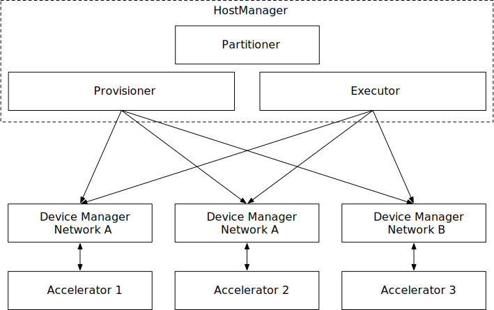
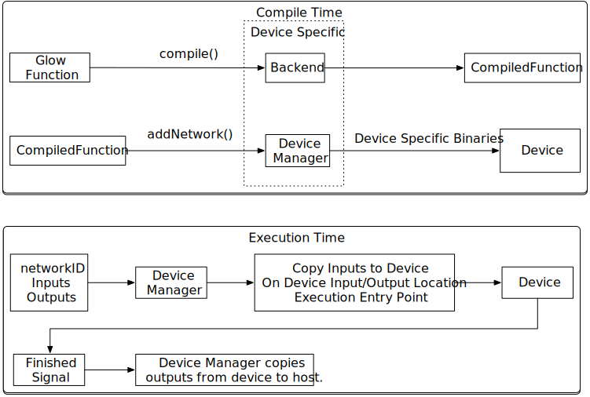
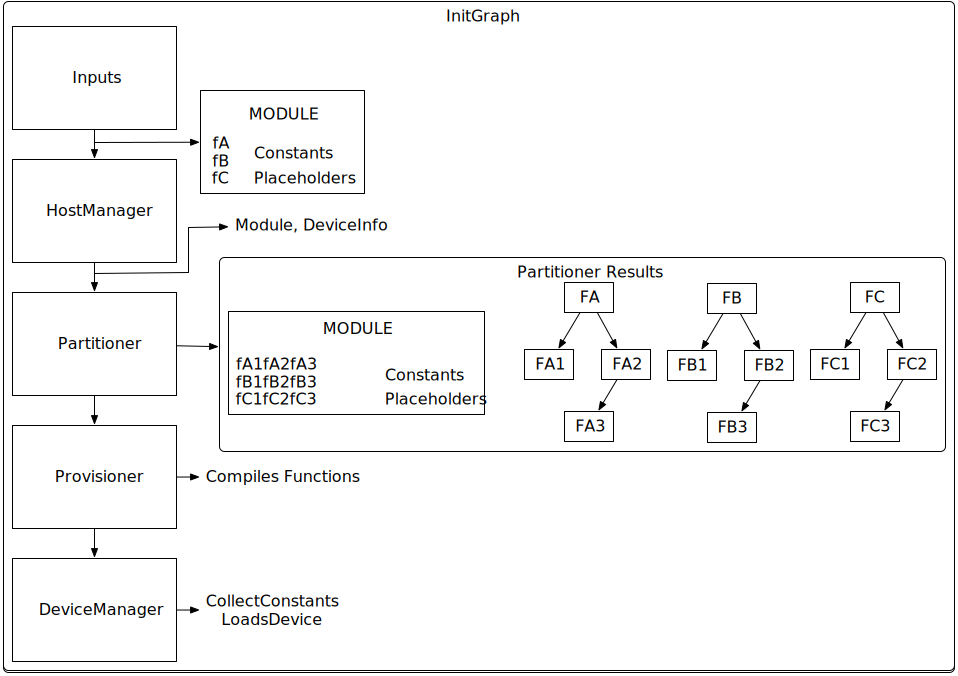
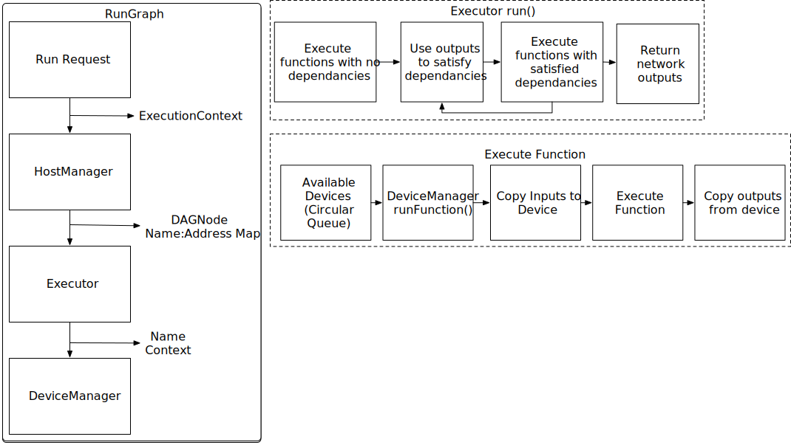

# Glow Runtime

The Glow runtime is responsible for handling adding and running networks on Glow.
Below is a high level view of the runtime architecture which consists of five key components: HostManager, DeviceManager, Partitioner, Provisioner, and Executor.

# Data Structures:
There are a few key data structures used by the runtime and can be found in RuntimeTypes.h, these are discussed below.

### DeviceInfo:
This structure contains information about the device that the partitioner will use to partition a network. This includes things like available memory and computation capability.

### DeviceConfig:
A base class used in configuring a DeviceManager. It is meant to contain information that allows the DeviceManager to uniquely identify the device and initialize it. 

### DAG
When a network is partitioned, its partitions and their relations are modeled in a directed acyclic graph (DAG). The DAG contains the information for the entire network. 

### DAGNode
The DAGNode is a single node in the DAG and contains everything needed to run a partition and model the partition's dependencies.

# Components
The runtime is composed of a few key elements: HostManager, Partitioner, Provisioner, Executor, and DeviceManager.

### Host Manager:

The HostManager is the container for the other components. It serves as the external interface, handling network init and run requests. The HostManager routes a request through the other components and stores the executionDAG for each network family member.

### Partitioner:

This component is responsible for dividing up the provided network into sub-networks that can be run on multiple devices. It receives a Module and DeviceInfo from the HostManager and lowers the module. Then it does the partitioning based on hardware constraints and heuristics to optimize execution time. It outputs a list of executionDAGs, one per network.

### Provisioner:

The Provisioner takes in the list of executionDAG and assigns sub-functions to specific devices. First, the Provisioner compiles each sub-function and stores them in a map. Then it passes a pointer to the compiledFunction and a Module reference to the DeviceManager to initialize the function on the device. Finally, it fills in the remaining fields of the excecutionDAGs and returns them in a list to the HostManager.

### Executor:

The Executor handles the execution of the network. It walks the executionDAG calling execution of each sub-network in accordance with their dependencies. This handles allocation of contexts for the sub-networks, and moving one network's outputs to the inputs of another network.

### Device Manager:

The DeviceManager is an abstraction for the device which runs on the host. The manager handles initializing the device, collecting constants and preparing the device for execution, and executing a network on the device. It also handles unloading networks from the device. There is a backend specific DeviceManager per backend type. 

# Device API:

There is a pairing between the backend and the device manager. The backend is provided a module which contains the computation graph. It returns a backend-specific compiled function which inherits from compiledFunction and contains the instructions to run the network on the device. The compiledFunction will serve as a container/abstraction for device-specific executable code. The specific format is left to the backend implementation. 

The backend specific device manager inherits from DeviceManager and consumes the compiledFunction generated by its matching backend. The DeviceManager knows how to copy the device specific code to the device and initialize it for execution. The DeviceManager also handles execution which means loading the inputs to the device waiting for the device to signal that the outputs are ready, and copying outputs from the device.

# Network Initialization:
Below we have a diagram illustrating the process of adding a network to the Runtime.
- A Module containing some functions to be added, is provided to the HostManager.
- The HostManager passes this Module along to the Partitioner which partitions the network.
- The DAGs which are output from the Partitioner are then passed to the Provisioner which handles actual device allocation.
- The DeviceManager handles preparing the device to run the function. This includes allocating memory on the device, copying constants from the Module to the device, and loading the function on the device.

# Network Execution:
For execution we have a similar diagram stepping through the network execution process.
- The HostManager is provided a network name and ExecutionContext.
- The HostManager passes the ExecutionContext on to the Executor, along with the DAG for the network.
- The Executor calls into the DeviceManager to kick off execution for all partitions which have no unment dependancies. It procedes to walk the DAG and execute each partition as its dependancies are met.

