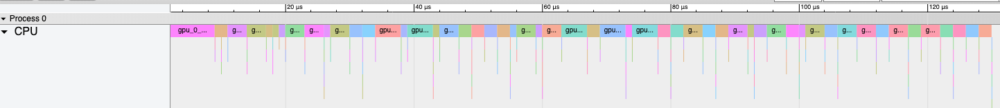
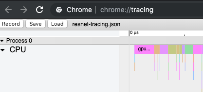

# Device Trace Events


Glow supports performance tracking and debugging via a system of Trace Events. The Glow Trace Event system is heavily based on [Google's Chromium Trace Event specification](https://docs.google.com/document/d/1CvAClvFfyA5R-PhYUmn5OOQtYMH4h6I0nSsKchNAySU) which defines a JSON-based format for logging a list of structured events.

By using the Chromium Trace Event Format we can leverage the existing trace viewer inside Chrome and integrate traces from multiple different sources into the same visualization.

This document is intended for hardware vendors as an introduction for how to integrate their internal system of hardware trace events into Glow. Glow Trace Events live within glow and as an interface to higher levels of a software stack which includes Glow. This document is not intended to specify a format between an accelerator device and the host, but may influence what information should be transferred across that interface.

If you want to jump right in there are [examples](#examples) at the bottom of this document, or use the glow/examples/tracing-compare binary to generate some traces.

### The Audience

Trace Events in Glow are one part of a wider monitoring and debugging infrastructure aimed at a specific but varied set of users with different purposes and requirements:

* Model developers, who want to understand the performance of their model on the device and need insights into hotspots or bottlenecks in the network in order to optimize it.
* Production and Capacity engineers, who want to understand the performance of standard models across different types of hardware and with various configurations so they can design and implement sharding and load balancing mechanisms at scale.
* Compiler engineers, who need to evaluate the effectiveness of optimizations or kernel implementations in detail in order to generate the best possible output code.
* Glow developers, who need to verify quickly that they haven't caused performance regressions.
* External parties who want to evaluate the performance of Glow and/or Glow-backed hardware accelerators.

### What to Log

Inside the Glow Runtime we instrument the various stages in the execution pipeline (e.g. via HostManager runNetwork) while executing a partitioned graph. If an execution is partitioned into multiple sections, the Glow Runtime will combine them into a single trace.

There are two main categories of event we are interested in at this level:

* Information about the timing (time cost or latency) of operators in the graph. When tracing is enabled each functional block in the final executable should have a start and end time that allows creating a timeline trace.
* Detailed information about important hardware events. The specific events will depend on hardware architecture, but in general we are interested particularly in events that increase latency but are not connected to the running of a particular operator (such as DRAM allocation, PCI transfers, or switching between execution units).



There is a large surface are which these events could be pulled from, use your judgement and keep the audiences above in mind for what to include (see verbosity section below).

### When to Log

Instrumenting or tracing execution can have overheads that may not be tolerated in all environments. For this reason we require a high level of configurability of when instrumentation and tracing occurs:

* Glow supports manual Trace Events with the **TraceEventNode** in the graph, which allows configuring more specific, coarse grained tracing information. This node should correspond to an instruction that takes a hardware timestamp when the appropriate point is reached in the execution of the network. Since these nodes do not produce outputs that are required by other nodes in the graph it is important to maintain the ordering of manual TraceEventNodes in the instruction scheduling process.
* At the compile stage the **autoInstrument** flag in the CompilationOptions structure enables instrumenting the compile of a network so that it is able to produce per operator Trace Events. If this flag is not enabled, there is no expectation of events at that level of detail (coarser grained events may still be produced).
* At the execution stage the **ExecutionContext** may contain a **TraceContext** member describing what level of Trace Event verbosity is requested for this run. At the time of writing there are five verbosity levels defined:
    * `NONE` - no Trace Events are required and none should be emitted.
    * `REQUEST`- only high level events relating to requests should be emitted (e.g. request beginning and end).
    * `RUNTIME` - only Glow Runtime events from on the host side should be emitted.
    * `OPERATOR` - Backend operator events should be emitted only, i.e. the time taken for each operator in the graph on the accelerator device. This may depend on compiling the network with operator level events (ie. autoInstrumenting).
    * `DEBUG` - Additional events for in depth debugging. This is intended for engineers familiar with the device and with Glow to triage performance issues in particular models. Many more events are permitted here, but included events should focus on what is high value for diagnosis issues.

TraceLevel is a bitmask and levels can be combined. The common default is:

    * `STANDARD` - currently equivalent to `RUNTIME | OPERATOR`.

Often the device specific runtime components are capable of emitting a large amount of hardware events. Please keep Trace Event memory size reasonable: a good guideline is about 1-2 Kb per millisecond of execution time on the device.

### The Format

Inside Glow TraceEvents are structs that have the following fields (loosely matching the JSON parameters from the TraceEvent format):

```
struct TraceEvent {
  string name;
  uint64_t timestamp;
  char type;
  int tid;
  uint64_t duration;
};
```

* name: The human interpretable name for the event. For operator events this is often the Glow-name for the node or instruction.
* timestamp: The time reported in microseconds since epoch in the std::steady_clock domain. Trace events are aggregated from a variety of sources (multiple devices + the host) and it's important that all timestamps are in the same domain so they can be visualized in a single trace. For an example of timestamp conversion see the OpenCLDeviceManager.
* type: A one character code for the kind of TraceEvent this represents. Glow supports four types of event:
    * “B” and “E”: where the timestamp represents the begin and end of the event respectively.
    * “I”: an event which has no duration, only an instant in time at the timestamp.
    * “X”: an event where the timestamp represents the begin of the event, and the duration field encodes the length. Complete events with this type can encode both beginning and end in a single event.
    * More detail on each type of event can be found in Chrome's [Trace Event Format doc](https://docs.google.com/document/d/1CvAClvFfyA5R-PhYUmn5OOQtYMH4h6I0nSsKchNAySU).
* tid: An identifier for the computation thread or flow that generated this event so that events produced in the same flow are associated in the result trace. This may or may not be equivalent to a system TID, but the Glow Runtime does not guarantee it will use the TID of the thread it logs the event in (and in fact does not use it). In the Chrome trace visualizer each distinct Thread ID will be represented as a different lane (row) in the trace.
* duration: Used for Complete events (type 'X') to encode the time taken by the event.

This structure is specified for use on the host inside Glow, and is not optimal for transferring hardware events from the device to the host.

### Visualizing and inspecting Traces

Once you have a JSON trace it is simple to visualize it using Chrome:

1. Browse to `chrome://tracing`
2. Drag and drop a Trace Event file, or hit the Load button:
3. 

### Implementation Details and Examples
<a name="examples"></a>

**Manual Trace Events:**

A Manual Trace Event is a node like any other in the function graph, and event data storage is backed by a Placeholder:

```
size_t numEvents = 2;
Placeholder *traceBacking = module.createPlaceholder(ElemKind::Int64Ty,
    {numEvents, 1}, "traceBacking", false);

F->createTraceEvent("functionName", "B", traceBacking, 0);

// Contents of Function

F->createTraceEvent("functionName", "E", traceBacking, 0);

// Compile Function F as usual
auto compiled = executionEngine.compile(F);
```

Then, to examine the events emitted for a particular run create a TraceContext with the desired verbosity, and it should be filled out with events after execution:

```
ExecutionContext ctx;
ctx.setTraceContext(std::make_unique<TraceContext>(TraceLevel::STANDARD));

// Run the compiled Function as usual
executionEngine.run(ctx);

std::vector<TraceEvent>& events = ctx.getTraceContext()->getTraceEvents();
for (TraceEvent& event : events) {
    // inspect event
}
```

**Auto Instrumentation**:

Set the autoInstrument option in the CompilationContext before compiling.

```
  CompilationContext cctx;
  cctx.compMode = CompilationMode::Infer;
  cctx.backendOpts.autoInstrument = true;
  backend->compile(F, cctx.backendOpts);
```

On a Backend that supports auto instrumentation this will decorate or configure the executable code such that Trace Events are inserted for each operator.

Events are emitted in the same way as for Manual events, in the TraceContext included in a run's ExecutionContext.

**Writing Trace Events to disk:**

A **TraceContext** can produce JSON files suitable to be visualized in chrome via the `dumpTraceEvents` method:

```
std::vector<TraceEvent>& events = ctx.getTraceContext()->getTraceEvents();
TraceEvent::dumpTraceEvents(events, "glow-trace.json", "glow");
```

This will output a **glow-trace.json** file in the current directory, where the process name is set to “glow”. The **tracing-compare** example in `glow/examples/` demonstrates this flow running multiple devices of different types.

In Onnxifi this can be configured to always dump Trace Events via the command line flag: `--glow-dump-debug-traces`.

**Inserting TraceEvents on the host:**

TraceEvents can be constructed in a variety of ways.

Firstly they can be constructed manually and inserted into the TraceContext:

```
TraceEvent ev("operator", TraceEvent::now(), "B", 1213);
events.push_back(ev);
```

TraceEvent::now() is a convenience function to take a timestamp of the current time in the correct timestamp domain.
This does not have any thread synchronization over the TraceContext, however, so be careful about concurrency.

They can be created via the TraceContext:

```
ctx.getTraceContext()->logTraceEvent("operator", TraceLevel::RUNTIME, "B", TraceEvent::now());
```

The timestamp is not required here, it will default to the current time.
This method is thread safe via a lock around the TraceContext.

If you prefer to use RAII to determine the beginning and end timestamps we provide the **ScopedTraceBlock**:

```
ScopedTraceBlock ev(ctx.getTraceContext(), TraceLevel::RUNTIME, "operator");
// do work
return;
```

This will produce a single Complete (type “X”) event which begins when the ScopedTraceBlock is created and ends when it leaves scope.
This form handles when the TraceContext is not set and does nothing.

Lastly we provide macros which may make using these primitives easier:

```
TRACE_EVENT_BEGIN(ctx.getTraceContext(), TraceLevel::REQUEST, "stage1");
// do work
TRACE_EVENT_END(ctx.getTraceContext(), TraceLevel::REQUEST, "stage1");

TRACE_EVENT_SCOPE(ctx.getTraceContext(), TraceLevel::REQUEST, "stage2");
// do different work
return;
```

The first version creates two events, with the begin (“B”) and end (“E”) types, while the last is equivalent to a **ScopedTraceBlock**.

There are versions which allow naming the event object (or **ScopedTraceBlock**) to support nesting of events.
